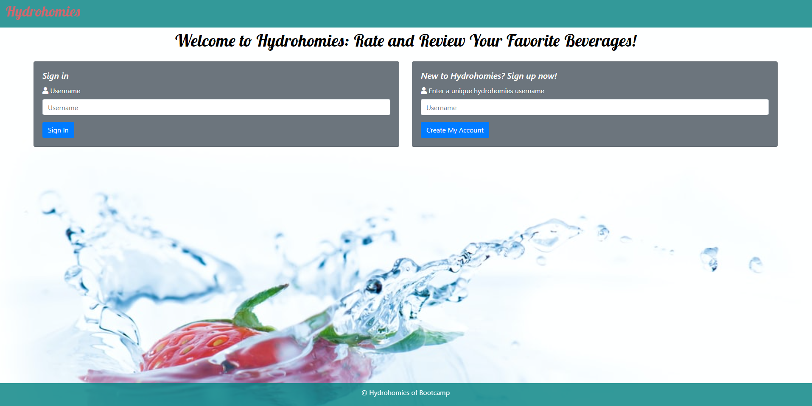
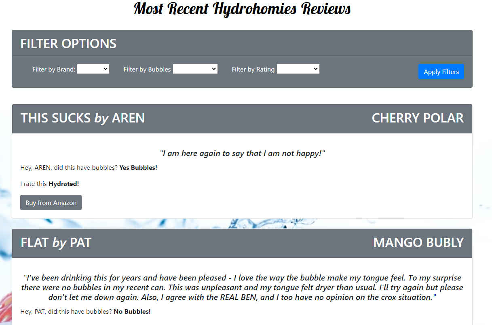
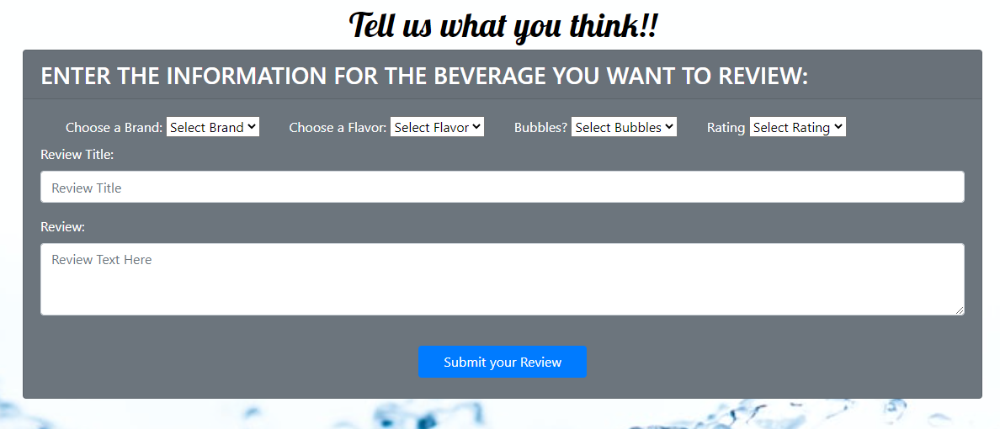
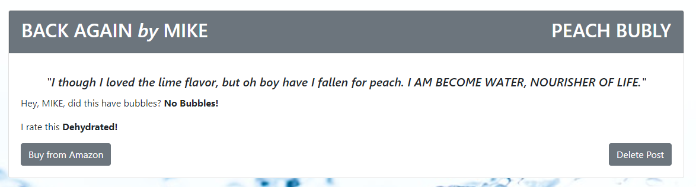
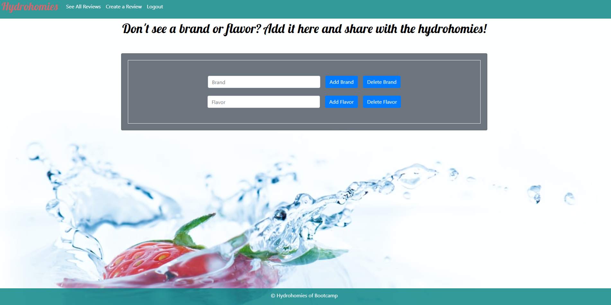

# Project: Hydrohomies

Deployed Site Link - > https://hydro-homies.herokuapp.com/index.html

Utilized https://github.com/harvesthq/chosen as a new technology.

## Table of Contents:

- [Project: Hydrohomies](#project-hydrohomies)
  - [Table of Contents:](#table-of-contents)
  - [License:](#license)
  - [Description:](#description)
  - [Installation Instructions:](#installation-instructions)
  - [Usage Instructions:](#usage-instructions)
  - [Github:](#github)
  - [Contact Us:](#contact-us)
  - [Other Contributors:](#other-contributors)
  - [Images:](#images)

## License:

## Description:

Problem: 

How do we pick something as important as the water we drink? Now-a-days people want to know if a product is good before they buy it, and they also don't want to be swayed by marketing. 

Hydrohomies is an application where users can rate and review beverages of their choice. With a very simple login process and clean, simple UI, it's super simple for a user to create a new review, read the reviews of other users, filter reviews by brand, carbonation, and/or rating, and add new brands and flavors to the application.

## Installation Instructions:

To install, type `npm install` into the terminal. This will install all the required node packages to run the server. Start the application by typing `npm start` into the terminal. 

## Usage Instructions: 
To view recent reviews either create a new user ID or log in with an existing ID. You can use filter options to narrow down results.
Once logged in you can also write a new review by clicking the Create A Review option in the navbar. On the Create page you can use the dropdown options and text areas to review your favorite water.
If the options you need are not listed in the dropdowns you can select the Add New Beverage tab in the Navbar to add a new brand or Flavor. You can also delete a brand or flavor from this page.

## Github:

Check out other projects of all contributors on their github accounts:  
James Knox (https://github.com/Pregicide)  
Shannon Quinn (https://github.com/shannonquinn91)  
Michael Rudolph (https://github.com/ReindeerCode)  
Aren Salmela (https://github.com/arensalmela)  
Junko Yamazaki (https://github.com/junkoyama)

## Contact Us:

If you have any questions please feel free to email us at our email addresses below:  
James Knox - jknox031@me.com  
Shannon Quinn - shannon.quinn91@gmail.com  
Michael Rudolph - ReindeerCode@gmail.com  
Aren Salmela - adsalmela@gmail.com  
Junko Yamazaki - junkoo.yamazaki@gmail.com

## Other Contributors:

James Knox (https://github.com/Pregicide) - WORKED ON FRONT END
Shannon Quinn (https://github.com/shannonquinn91) - WORKED ON FRONT END
Michael Rudolph (https://github.com/ReindeerCode) - WORKED ON BACK END
Aren Salmela (https://github.com/arensalmela)  - WORKED ON BACK END
Junko Yamazaki (https://github.com/junkoyama) - WORKED ON FRONT END

## Images:

Sign in Page

Reviews Page

Create a Review

Delete Review

Add/Delete Brands

